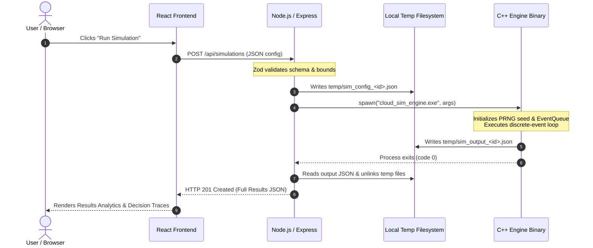
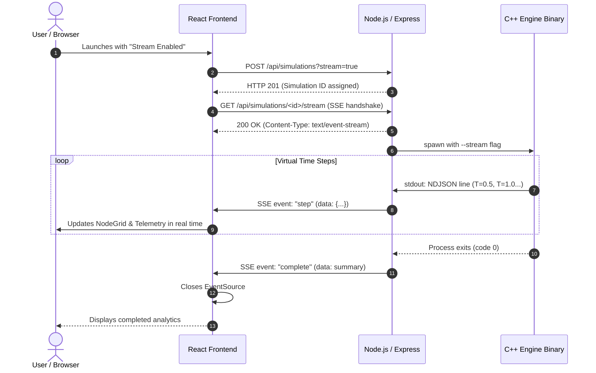
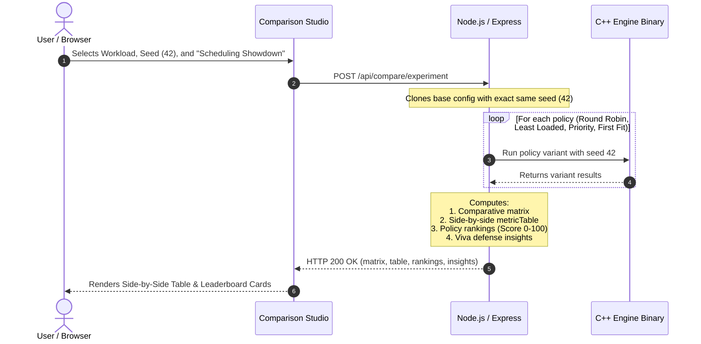

# System Architecture & Technical Design

This document details the multi-tier architecture, inter-process communication (IPC), security mechanisms, and data flow of the **Cloud Event Simulator**.

---

## 1. High-Level Architecture Overview

The system employs a strict three-tier layered architecture:

```
+-------------------------------------------------------------------------+
|                        TIER 1: REACT FRONTEND                           |
|  - SPA built with React 18, Vite, and custom CSS design system          |
|  - Pages: Dashboard, Workload Studio, Console, Results, Comparison      |
|  - Communication: Fetch API (REST) + EventSource (Server-Sent Events)   |
+------------------------------------+------------------------------------+
                                     |
                                     | HTTP REST & SSE (Port 5050)
                                     v
+------------------------------------+------------------------------------+
|                   TIER 2: NODE.JS / EXPRESS BACKEND                     |
|  - HTTP Web Server on port 5050 (Express)                               |
|  - Security: Helmet, CORS, Rate Limiting (express-rate-limit)            |
|  - Input Validation: Zod schema bounds enforcement                      |
|  - Process Controller: Manages C++ binary execution and timeouts        |
|  - SSE Broadcaster: Streams stdout NDJSON to connected browser clients   |
|  - Experiment Benchmarking & Multi-Objective Ranking                    |
|  - Static Hosting: Serves frontend/dist bundle in production            |
+------------------------------------+------------------------------------+
                                     |
                                     | IPC: Process Spawn + JSON Files + Stdout NDJSON
                                     v
+------------------------------------+------------------------------------+
|             TIER 3: C++ DISCRETE-EVENT SIMULATION ENGINE                |
|  - Native executable (cloud_sim_engine.exe) built with C++14 (-O3)      |
|  - Virtual Clock, EventQueue (std::priority_queue)                      |
|  - Pluggable Schedulers (Round Robin, Least Loaded, Priority, First Fit)|
|  - Pluggable Load Balancers (Round Robin, Least Connections, Weighted)  |
|  - ResourcePool & Virtual Compute Nodes (vCPU, RAM, Bounded Queues)     |
|  - AutoScaler (Thresholds & Cooldown Hysteresis)                        |
|  - FailureManager (Outage injection, task eviction, node recovery)      |
|  - MetricsCollector (Percentiles, Throughput, Cost, SLA)               |
+-------------------------------------------------------------------------+
```

---

## 2. Why This Architecture?

### Why is Simulation Logic in C++?
1. **Cache Locality & Memory Layout**: A 50,000-event simulation requires inserting and popping elements from a priority queue thousands of times per second. C++ `std::priority_queue` with contiguous vector storage provides optimal cache hit rates.
2. **Zero Garbage Collection Pauses**: JavaScript engines (V8) periodically trigger garbage collection sweeps. These GC pauses introduce nondeterministic execution delays that interfere with micro-benchmarking.
3. **Execution Speed**: The native C++ engine executes a 60-second simulated cluster workload with hundreds of tasks in 15 to 40 milliseconds of wall-clock time.
4. **Portability**: The C++ engine has zero external library dependencies and compiles cleanly on Windows (MinGW/MSVC), Linux (GCC/Clang), and macOS.

### Why is Node.js / Express the Middle Tier?
1. **Separation of Concerns**: C++ is optimal for CPU-bound simulation math, but writing an HTTP web server, TLS termination, CORS headers, and SSE streaming directly in C++ adds unnecessary complexity.
2. **Robust Process Management**: Node.js `child_process` provides process control, signal handling (`SIGKILL`), and safety timeouts.
3. **Security Boundary**: The Node backend isolates the native executable from direct network access, enforcing Zod schema validation before any arguments touch the C++ engine.

### Why React for the Frontend?
1. **Component-Based UI**: Allows clean modularization of KPI cards, virtual node progress bars, interactive time-scrubbers, and data tables.
2. **Reactive State**: The user interface updates dynamically as SSE events arrive without full-page reloads.

---

## 3. Communication Protocols & Data Flow

### A. Control Plane: REST API
Used for configuration submission, catalog retrieval, and comparison requests:
- `GET /health`: Health verification.
- `GET /api/presets`: Retrieves catalog of pre-configured scenarios.
- `POST /api/simulations`: Submits a simulation configuration for execution.
- `POST /api/compare`: Compares two or more completed simulation runs.
- `POST /api/compare/experiment`: Executes a multi-policy benchmark across identical seeds.

### B. Inter-Process Communication (IPC): Node to C++
The Node backend communicates with the compiled C++ binary using a hybrid file-and-pipe protocol:
1. **Configuration Input**: Node writes validated JSON to `backend/temp/sim_config_<id>.json`.
2. **Process Invocation**: Node invokes `cloud_sim_engine.exe --config <tempConfigFile> --output <tempOutputFile> [--stream]`.
3. **Real-time Progress Stream**: If `--stream` is enabled, the C++ engine outputs a single NDJSON (Newline Delimited JSON) line to standard output (`stdout`) for every time-step.
4. **Bulk Results Output**: Upon completion, the C++ engine writes the complete results payload (summary, node states, snapshots, scaling logs, decision traces) to `backend/temp/sim_output_<id>.json`.
5. **Cleanup**: Node reads the output file, stores the result in memory, and immediately deletes both temporary files.

### C. Live Observability: Server-Sent Events (SSE)
When the user runs a simulation with live streaming enabled, the frontend opens an SSE connection:
```javascript
const eventSource = new EventSource('/api/simulations/<id>/stream');
```
- Node's process controller listens on the C++ child process `stdout.on('data')`.
- It buffers and splits lines by `\n`.
- For each valid JSON line, it broadcasts:
  ```text
  event: step
  data: {"timestamp": 12.0, "active_nodes": 3, "cpu_util": 68.5, ...}
  ```
- When the process exits, it broadcasts:
  ```text
  event: complete
  data: {"status": "COMPLETED", "summary": {...}}
  ```
- The frontend `EventSource` receives the `complete` event and automatically closes the connection.

---

## 4. Sequence Diagrams

### 1. Standard Simulation Execution Flow



---

### 2. Real-Time Streaming Execution Flow (SSE)



---

### 3. Multi-Policy Experiment Benchmark Flow



---

## 5. Security & Isolation Architecture

The backend implements defense-in-depth security principles:

1. **Process Injection Prevention**:
   - Spawns executable via `child_process.spawn(ENGINE_PATH, args, { windowsHide: true })`.
   - Never uses `child_process.exec()` or shell command strings (`shell: false`). User input cannot inject arbitrary shell commands.
2. **Watchdog Safety Timeout**:
   - A timer (`setTimeout(..., 45000)`) starts with every spawn.
   - If a simulation does not terminate within 45 seconds of wall-clock time, Node executes `child.kill('SIGKILL')` and returns an HTTP 500 timeout error.
3. **Zod Input Schema Validation**:
   - Rejects unexpected fields and enforces numerical boundaries:
     - `duration`: $[1.0, 600.0]$ seconds.
     - `initial_nodes`: $[1, 32]$ nodes.
     - `request_rate`: $[0.1, 500.0]$ req/s.
     - `node_queue_limit`: $[1, 500]$ tasks.
4. **Network Hardening**:
   - `helmet`: Sets secure HTTP headers (`X-Content-Type-Options`, `X-Frame-Options`, `Strict-Transport-Security`).
   - `cors`: Configured for origin control.
   - `express-rate-limit`: Limits requests to 120 per minute per IP.

---

## 6. Error Handling & Failure Modes

| Failure Scenario | Where Detected | System Behavior | User Experience |
| :--- | :--- | :--- | :--- |
| **Malformed JSON Configuration** | Node / Express | Zod validation fails (`status 400`). Engine is never spawned. | Error banner displays exact field validation errors. |
| **C++ Engine Crash / Segfault** | Node Process Controller | Child process emits non-zero exit code (`code !== 0`). Stderr is captured. | Error banner displays: `Engine exited with code N. Error: <stderr>`. |
| **Runaway Simulation (Infinite Loop)** | Node Watchdog Timer | 45-second timer fires; process killed via `SIGKILL`. | Error banner displays: `Simulation exceeded 45-second safety timeout`. |
| **Client Disconnects Mid-Stream** | Express Route | Client drops SSE socket. Child process continues to completion in background. | Background run completes cleanly; results remain available in history. |
| **All Nodes Crash in Simulation** | C++ Simulation Engine | Schedulers detect zero operational nodes. Tasks rejected with explainable log. | Dashboard shows 0% availability; decision log explains: `All nodes offline`. |
